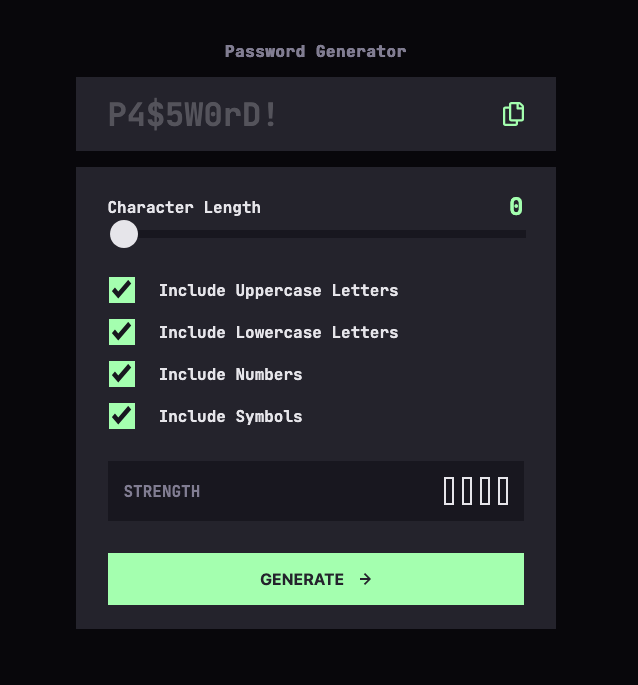

# Frontend Mentor - Password generator app solution

This is a solution to the [Password generator app challenge on Frontend Mentor](https://www.frontendmentor.io/challenges/password-generator-app-Mr8CLycqjh). Frontend Mentor challenges help you improve your coding skills by building realistic projects. 

## Table of contents

- [Frontend Mentor - Password generator app solution](#frontend-mentor---password-generator-app-solution)
  - [Table of contents](#table-of-contents)
  - [Overview](#overview)
    - [The challenge](#the-challenge)
    - [Screenshot](#screenshot)
    - [Links](#links)
  - [My process](#my-process)
    - [Built with](#built-with)
    - [What I learned](#what-i-learned)
  - [Author](#author)
  - [Acknowledgments](#acknowledgments)

**Note: Delete this note and update the table of contents based on what sections you keep.**

## Overview

### The challenge

Users should be able to:

- Generate a password based on the selected inclusion options
- Copy the generated password to the computer's clipboard
- See a strength rating for their generated password
- View the optimal layout for the interface depending on their device's screen size
- See hover and focus states for all interactive elements on the page

### Screenshot

### Links

- Solution URL: [Github Code](https://github.com/nursh/FM-Password-Generator)
- Live Site URL: [Live Site URL](nursh.github.io/FM-Password-Generator/)

## My process

### Built with

- Semantic HTML5 markup
- CSS
- JavaScript

### What I learned

I learnt a lot about the input range element and how different browsers implement its details.
I also learnt a bit about passwords and entropy

## Author

- Frontend Mentor - [@yourusername](https://www.frontendmentor.io/profile/nursh)

## Acknowledgments

The MDN documents were a big help and the [CSS-Tricks article](https://css-tricks.com/sliding-nightmare-understanding-range-input/)